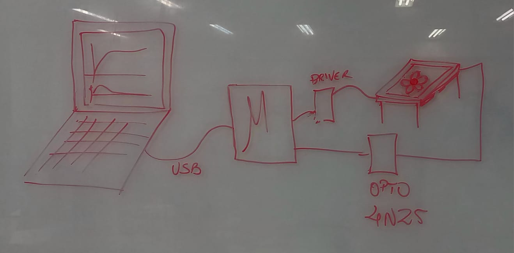
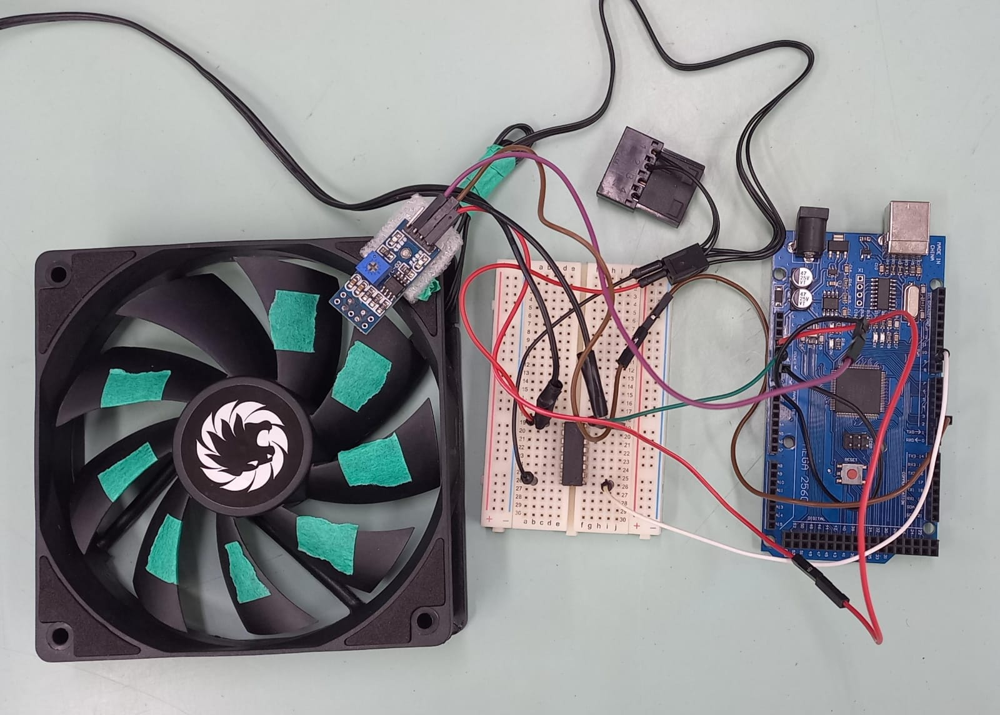

# Controle do RPM por meio do controlador PID

## Objetivo

O objetivo deste projeto é controlar a velocidade de um cooler utilizando a técnica de modulação por largura de pulso (PWM), combinada com um controlador PID(Proporcional-Integral-Derivativo). Através do ajuste do ciclo de trabalho do PWM, é possível controlar a quantidade de energia entregue ao cooler, variando sua velocidade de rotação. Além disso, o controlador PID é utilizado para ajustar automaticamente a velocidade do cooler com base em uma referência desejada, permitindo um controle preciso, eficiente e estável da rotação.

## Materias Utilizados 

**Tabela de materiais**

| Item | Quantidade                                | 
| ------ | ----------------------------------- | 
| Cooler GMX-WFBK BK com 9 pás   | 1 UND
| Driver de motor ULN2003    |  1 UND 
| Módulo Sensor Infravermelho Tcrt5000     |  1 UND 
| Arduino Mega 2560    |  1 UND 
|Fonte de alimentação  12 V | 1 UND
|Jumpers | 15 UND

**Software**

- Arduino IDE  
- Linguagem C++
- Biblioteca controle PID 

## Resultados e Conclusão 

Com o uso do controlador PID e do PWM, o projeto demonstrou ser capaz de controlar a velocidade do cooler de forma satisfatória. No entanto, o controle ainda apresentou erros ou instabilidade quando houve mudanças de carga. Isso indica que a sintonia do controle PID não está completamente otimizada para lidar com essas variações. Acreditamos que, para melhorar o desempenho, será necessário realizar ajustes mais refinados nos parâmetros de controle PID, a fim de minimizar as oscilações e garantir uma resposta mais estável em condições variáveis.

### Equipe 

- Heloíse Bastos **https://github.com/heloisebastos**

- Joicy Kelly **https://github.com/Joicylara**
